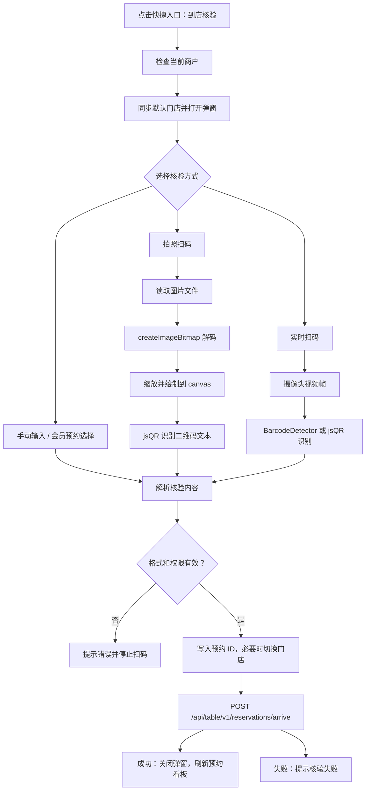

# 快捷功能「到店核验 / 拍照扫码」移植实现文档

本文档整理当前项目首页快捷功能中的「到店核验」逻辑，重点说明「拍照扫码核验」链路，并补充实时扫码、手动输入、会员预约选择等同属核验闭环的实现细节，方便迁移到其他项目。

## 1. 当前实现位置

- 入口页面：`src/views/home/index.vue`
- 快捷入口：`quickActions` 中标题为「到店核验」的项，点击后调用 `openArriveVerifyModal`
- 弹窗 UI：`arriveVerifyOpen` 对应的 `<a-modal title="到店核验">`
- 识别依赖：`jsqr`
- 核验接口：`postApiTableV1ReservationsArrive`
- 相关接口定义：`src/services/basis/basis.ts`
- 门店权限来源：`authStore.currentTenantStores`

## 2. 功能边界

该快捷功能解决的是后台操作员在首页快速确认会员预约已到店的问题。

当前入口支持四种核验方式：

1. 手动输入预约 ID 或完整核验内容。
2. 拍照扫码：通过 `<input type="file" accept="image/*" capture="environment">` 调起手机相机或相册，识别照片中的二维码。
3. 实时扫码：通过 `navigator.mediaDevices.getUserMedia` 调起摄像头，循环识别视频帧。
4. 会员手机号查询预约：查出当前门店待到店预约后，点击「核验」直接提交。

迁移时如果只需要「拍照核验」，可以只移植第 2 种方式，但仍需要保留同一套「核验内容解析、权限校验、提交接口」逻辑。

## 3. 依赖清单

### 3.1 npm 依赖

```json
{
  "dependencies": {
    "jsqr": "^1.4.0"
  }
}
```

当前项目还使用：

- `vue`
- `ant-design-vue`
- `@lucide/vue`
- 项目内自动生成的 API SDK
- `pinia` 中的 `authStore`

这些不是拍照识别本身的硬依赖，迁移时可以替换为目标项目自己的 UI、状态管理和请求层。

### 3.2 浏览器能力

拍照扫码链路依赖：

- `input[type=file]`
- `accept="image/*"`
- `capture="environment"`：移动端优先提示使用后置摄像头；桌面端通常退化为文件选择。
- `createImageBitmap(file)`：将图片文件解码为位图。
- `HTMLCanvasElement`
- `CanvasRenderingContext2D.getImageData`
- `jsQR(imageData.data, width, height)`

实时扫码链路额外依赖：

- `navigator.mediaDevices.getUserMedia`
- `BarcodeDetector`，仅作为优先识别器，浏览器不支持时自动退回 canvas + `jsQR`
- `requestAnimationFrame`

注意：实时摄像头通常要求 HTTPS 或 localhost 环境，拍照文件选择不受这个限制。

## 4. 二维码内容协议

### 4.1 新版完整核验码

当前解析逻辑要求新版二维码内容是 URL 或 query string，并包含以下 query 字段：

| 字段 | 含义 | 必填 |
| --- | --- | --- |
| `r` | 预约 ID | 是 |
| `m` | 商户 ID | 是 |
| `s` | 门店 ID | 是 |
| `u` | 会员 ID | 是 |

示例：

```text
https://example.com/reservation/arrive?r=RESERVATION_ID&m=MERCHANT_ID&s=STORE_ID&u=MEMBER_ID
```

或者：

```text
r=RESERVATION_ID&m=MERCHANT_ID&s=STORE_ID&u=MEMBER_ID
```

当前提交接口实际只使用 `r` 作为预约 ID，并使用 `s` 作为 `x-store-id` 请求头；`m` 和 `s` 会先在前端做权限校验；`u` 当前用于确认二维码是完整新版协议。

### 4.2 老版兼容码

如果二维码不是新版协议，则进入兼容解析：

- 如果是 URL，依次读取 query 字段：`id`、`reservationId`、`code`、`verifyCode`、`arriveCode`
- 如果上述字段都没有，取 URL path 的最后一段
- 如果不是 URL 且不包含 `=`，直接把整段文本当作预约 ID
- 如果不是 URL 且包含 `=`，判定为格式错误

这意味着以下内容仍可提交：

```text
RESERVATION_ID
https://example.com/check/RESERVATION_ID
https://example.com/check?id=RESERVATION_ID
https://example.com/check?reservationId=RESERVATION_ID
```

## 5. 外部数据与权限依赖

迁移时需要在目标项目提供以下上下文：

| 上下文 | 当前项目来源 | 用途 |
| --- | --- | --- |
| 当前商户 ID | `authStore.userInfo?.merchantId` 或 `localStorage.merchantId` | 校验二维码 `m` 是否属于当前商户 |
| 当前门店 ID | `authStore.userInfo?.storeId` 或 `localStorage.storeId` | 默认核验门店 |
| 可操作门店列表 | `authStore.currentTenantStores` | 校验二维码 `s` 是否在操作员权限内 |
| 选中核验门店 | `selectedTableStoreId` | 提交 `x-store-id` 请求头 |

当前项目会过滤掉 `ALL_STORE_ID`，只允许选择真实门店：

```ts
const tableStoreOptions = computed(() =>
  authStore.currentTenantStores
    .filter(store => {
      const id = String(store.id || "").trim()
      return id && id !== ALL_STORE_ID
    })
    .map(store => ({
      label: String(store.name || `门店 ${store.id}`).trim(),
      value: String(store.id || "").trim(),
      merchantId: store.merchantId,
      merchantName: store.merchantName,
    })),
)
```

## 6. UI 结构

弹窗包含四块：

1. 门店选择：`selectedTableStoreId`
2. 预约 ID 输入：`arriveVerifyCode`
3. 会员预约查询：可选增强能力
4. 扫码操作区：实时扫码按钮 + 拍照扫码按钮 + 识别状态区

拍照扫码按钮的核心结构：

```vue
<label class="arrive-capture-button">
  <CameraOutlined />
  <span>拍照扫码</span>
  <input
    type="file"
    accept="image/*"
    capture="environment"
    @change="handleArriveCaptureChange"
  />
</label>
```

要点：

- 使用 `label` 包裹隐藏的 file input，让整块按钮可点击。
- `capture="environment"` 是移动端后置摄像头提示，不保证所有浏览器都遵守。
- 每次选择文件后要清空 `input.value`，否则连续选择同一张照片不会触发 `change`。

## 7. 核心状态

当前实现中的关键状态如下：

```ts
const arriveVerifyOpen = ref(false)
const arriveVerifyCode = ref("")
const arriveVerifying = ref(false)
const arriveScanActive = ref(false)
const arriveScanMessage = ref("")
const arriveScanVideoRef = ref<HTMLVideoElement | null>(null)

let arriveScanStream: MediaStream | null = null
let arriveScanFrameId = 0
let arriveScanDetector: BarcodeDetectorInstance | null = null
let arriveScanCanvas: HTMLCanvasElement | null = null
let arriveScanDetecting = false
```

拍照链路最少需要：

- `arriveVerifyCode`
- `arriveVerifying`
- `arriveScanMessage`
- `arriveScanCanvas`
- `selectedTableStoreId`
- 当前商户和可操作门店上下文

实时扫码才需要：

- `arriveScanActive`
- `arriveScanVideoRef`
- `arriveScanStream`
- `arriveScanFrameId`
- `arriveScanDetector`
- `arriveScanDetecting`

## 8. 流程总览



## 9. 核心实现说明

### 9.1 打开弹窗

逻辑：

1. 必须有当前商户 ID，否则提示「请先选择可核验的商户」。
2. 清空上次输入和扫码消息。
3. 如果未选门店，按权限列表同步一个默认门店。
4. 打开弹窗。

当前函数：`openArriveVerifyModal`

```ts
function openArriveVerifyModal() {
  if (!merchantId.value) {
    message.warning("请先选择可核验的商户")
    return
  }
  arriveVerifyCode.value = ""
  arriveScanMessage.value = ""
  if (!selectedTableStoreId.value) {
    syncSelectedTableStore()
  }
  arriveVerifyOpen.value = true
}
```

### 9.2 解析新版核验码

当前函数：`parseArriveVerifyPayload`

```ts
interface ArriveVerifyPayload {
  reservationId: string
  merchantId: string
  storeId: string
  memberId: string
}

function parseArriveVerifyPayload(rawValue: string): ArriveVerifyPayload | null {
  const text = String(rawValue || "").trim()
  if (!text) return null

  const paramsCandidates: URLSearchParams[] = []
  try {
    const url = new URL(text)
    paramsCandidates.push(url.searchParams)
  } catch {
    paramsCandidates.push(new URLSearchParams(text.startsWith("?") ? text.slice(1) : text))
  }

  for (const params of paramsCandidates) {
    const reservationId = String(params.get("r") || "").trim()
    const merchantIdValue = String(params.get("m") || "").trim()
    const storeIdValue = String(params.get("s") || "").trim()
    const memberId = String(params.get("u") || "").trim()

    if (reservationId && merchantIdValue && storeIdValue && memberId) {
      return {
        reservationId,
        merchantId: merchantIdValue,
        storeId: storeIdValue,
        memberId,
      }
    }
  }

  return null
}
```

### 9.3 兼容老版核验码

当前函数：`extractArriveLegacyVerifyCode`

```ts
function extractArriveLegacyVerifyCode(rawValue: string) {
  const text = String(rawValue || "").trim()
  if (!text) return ""

  try {
    const url = new URL(text)
    for (const key of ["id", "reservationId", "code", "verifyCode", "arriveCode"]) {
      const value = String(url.searchParams.get(key) || "").trim()
      if (value) return value
    }

    const lastPath = url.pathname.split("/").filter(Boolean).pop()
    return String(lastPath || "").trim() || text
  } catch {
    return text.includes("=") ? "" : text
  }
}
```

### 9.4 统一解析和权限校验

当前函数：`resolveArriveVerifyFromRaw`

```ts
type ArriveVerifyResolveResult =
  | { status: "empty" }
  | { status: "invalid"; message: string }
  | { status: "valid"; reservationId: string; storeId?: string }

function resolveArriveVerifyFromRaw(rawValue: string): ArriveVerifyResolveResult {
  const text = String(rawValue || "").trim()
  if (!text) return { status: "empty" }

  const payload = parseArriveVerifyPayload(text)
  if (!payload) {
    const legacyCode = extractArriveLegacyVerifyCode(text)
    return legacyCode
      ? { status: "valid", reservationId: legacyCode }
      : { status: "invalid", message: "二维码格式不正确，请确认预约核验码" }
  }

  if (payload.merchantId !== merchantId.value) {
    return {
      status: "invalid",
      message: "该预约商户/门店不在操作权限内",
    }
  }

  const canOperateStore = tableStoreOptions.value.some(option => option.value === payload.storeId)
  if (!canOperateStore) {
    return {
      status: "invalid",
      message: "该预约商户/门店不在操作权限内",
    }
  }

  return {
    status: "valid",
    reservationId: payload.reservationId,
    storeId: payload.storeId,
  }
}
```

迁移建议：把 `merchantId.value` 和 `tableStoreOptions.value` 改成函数参数，做成纯函数，方便单元测试。

```ts
function resolveArriveVerifyFromRaw(
  rawValue: string,
  context: {
    merchantId: string
    canOperateStore: (storeId: string) => boolean
  },
): ArriveVerifyResolveResult {
  // 复用同样规则
}
```

### 9.5 拍照图片解码

当前函数：`decodeArriveCodeFromImage`

```ts
async function decodeArriveCodeFromImage(file: File) {
  const bitmap = await createImageBitmap(file)
  const maxSize = 1400
  const scale = Math.min(1, maxSize / Math.max(bitmap.width, bitmap.height))
  const width = Math.max(1, Math.round(bitmap.width * scale))
  const height = Math.max(1, Math.round(bitmap.height * scale))

  const canvas = getArriveScanCanvas()
  canvas.width = width
  canvas.height = height

  const context = canvas.getContext("2d", { willReadFrequently: true })
  if (!context) return ""

  context.drawImage(bitmap, 0, 0, width, height)
  bitmap.close()

  const imageData = context.getImageData(0, 0, width, height)
  return jsQR(imageData.data, width, height)?.data || ""
}
```

关键点：

- 复用同一个离屏 canvas，避免重复创建 DOM 对象。
- 将图片最长边限制到 `1400px`，减少大图识别时的内存和耗时。
- `willReadFrequently: true` 适合频繁 `getImageData` 的场景。
- 识别结果为空字符串表示没有识别到二维码。
- `bitmap.close()` 释放位图资源。

如果目标项目需要兼容不支持 `createImageBitmap` 的旧 WebView，可以补充 `Image + URL.createObjectURL(file)` 的 fallback。

### 9.6 拍照按钮 change 处理

当前函数：`handleArriveCaptureChange`

```ts
async function handleArriveCaptureChange(event: Event) {
  const input = event.target as HTMLInputElement
  const file = input.files?.[0]
  input.value = ""
  if (!file) return

  stopArriveScan()
  arriveScanMessage.value = "正在识别照片"

  try {
    const rawValue = await decodeArriveCodeFromImage(file)
    if (resolveArriveScannedValue(rawValue)) return
    arriveScanMessage.value = "未识别到二维码，请重新拍摄或手动输入"
  } catch (error) {
    console.warn("decode arrive capture failed", error)
    arriveScanMessage.value = "照片识别失败，请重新拍摄或手动输入"
  }
}
```

关键点：

- 拿到文件后立即 `input.value = ""`，保证选择同一文件也能重复触发。
- 拍照识别前先停止实时扫码，避免同时占用摄像头或出现重复提交。
- 解码成功后不直接提交接口，而是走 `resolveArriveScannedValue`，保证拍照、实时扫码、手动输入共用同一套校验规则。

### 9.7 扫码结果统一处理

当前函数：`resolveArriveScannedValue`

```ts
function resolveArriveScannedValue(rawValue: string) {
  const result = resolveArriveVerifyFromRaw(rawValue)

  if (result.status === "empty") return false

  if (result.status === "invalid") {
    arriveScanMessage.value = result.message
    message.warning(result.message)
    stopArriveScan()
    return true
  }

  if (result.storeId && selectedTableStoreId.value !== result.storeId) {
    selectedTableStoreId.value = result.storeId
  }

  arriveVerifyCode.value = result.reservationId
  arriveScanMessage.value = "已识别核验码"
  stopArriveScan()
  void submitArriveVerify()
  return true
}
```

返回值含义：

- `false`：没有识别到有效内容，拍照链路继续显示「未识别到二维码」。
- `true`：已经消费了识别结果，无论成功还是格式错误，都不再继续后续识别。

### 9.8 提交到店核验

当前函数：`submitArriveVerify`

```ts
async function submitArriveVerify() {
  if (!selectedTableStoreId.value) {
    message.warning("请先选择核验门店")
    return
  }

  const rawCode = arriveVerifyCode.value.trim()
  const resolved = resolveArriveVerifyFromRaw(rawCode)

  if (resolved.status === "empty") {
    message.warning("请输入核验码")
    return
  }

  if (resolved.status === "invalid") {
    arriveScanMessage.value = resolved.message
    message.warning(resolved.message)
    return
  }

  const code = resolved.reservationId

  if (resolved.storeId && selectedTableStoreId.value !== resolved.storeId) {
    selectedTableStoreId.value = resolved.storeId
  }

  const verifyStoreId = String(resolved.storeId || selectedTableStoreId.value || "").trim()
  if (!verifyStoreId) {
    message.warning("请先选择核验门店")
    return
  }

  if (arriveVerifying.value) return
  arriveVerifying.value = true

  const arriveRequestOptions = {
    headers: {
      "x-store-id": verifyStoreId,
    },
  } as Parameters<typeof postApiTableV1ReservationsArrive>[1]

  try {
    await postApiTableV1ReservationsArrive({ id: code }, arriveRequestOptions)
    message.success("到店核验成功")
    arriveVerifyOpen.value = false
    stopArriveScan()
    void queryTableReservationBoard()
  } catch (error) {
    console.warn("arrive verify failed", error)
    message.error("到店核验失败，请确认核验码是否有效")
  } finally {
    arriveVerifying.value = false
  }
}
```

接口契约：

```http
POST /api/table/v1/reservations/arrive
Content-Type: application/json
x-store-id: STORE_ID

{
  "id": "RESERVATION_ID"
}
```

当前返回体为空对象，成功即代表到店确认成功。

提交前会再次调用 `resolveArriveVerifyFromRaw`，这是必要的：用户可能手动输入完整二维码内容，也可能扫码后被写入预约 ID。

### 9.9 实时扫码补充

实时扫码不是拍照核验必需项，但当前功能包含这一能力。

启动流程：

1. 检查 `navigator.mediaDevices?.getUserMedia`
2. 初始化 `BarcodeDetector`，格式包含 `qr_code`、`code_128`、`code_39`、`ean_13`
3. 优先请求后置摄像头和 1280x720：

```ts
await navigator.mediaDevices.getUserMedia({
  video: {
    facingMode: { ideal: "environment" },
    width: { ideal: 1280 },
    height: { ideal: 720 },
  },
  audio: false,
})
```

4. 如果失败，退化为：

```ts
await navigator.mediaDevices.getUserMedia({
  video: true,
  audio: false,
})
```

5. 将 stream 绑定到 video，播放后进入 `requestAnimationFrame` 循环。
6. 每帧优先用 `BarcodeDetector.detect(video)`；没有结果或失败时，用 canvas 截帧后 `jsQR` 识别。

停止流程必须释放资源：

```ts
function stopArriveScan() {
  if (arriveScanFrameId) {
    cancelAnimationFrame(arriveScanFrameId)
    arriveScanFrameId = 0
  }

  if (arriveScanStream) {
    arriveScanStream.getTracks().forEach(track => track.stop())
    arriveScanStream = null
  }

  if (arriveScanVideoRef.value) {
    arriveScanVideoRef.value.srcObject = null
  }

  arriveScanDetecting = false
  arriveScanActive.value = false
}
```

弹窗关闭和页面卸载时都要调用 `stopArriveScan`。

## 10. 可选能力：会员手机号查询预约

这块不是拍照核验核心，但属于当前快捷功能的兜底入口。

流程：

1. 操作员输入会员手机号。
2. 调用会员列表接口，按当前商户查询启用会员：

```ts
getApiMemberV1Members({
  "pageRequest.page": 1,
  "pageRequest.pageSize": 10,
  merchantId,
  status: 1,
  phone,
})
```

3. 默认选中第一个会员。
4. 调用预约列表接口，查询当前门店 `pending` 预约：

```ts
getApiTableV1Reservations({
  "pageRequest.page": 1,
  "pageRequest.pageSize": 100,
  merchantId,
  storeId,
  status: "pending",
})
```

5. 前端再按 `memberId` 过滤。
6. 点击预约行的「核验」按钮，将预约 ID 写入 `arriveVerifyCode`，再调用 `submitArriveVerify`。

迁移时可根据目标项目情况决定是否保留。

## 11. 成功后的页面联动

核验成功后当前项目会：

1. 提示「到店核验成功」。
2. 关闭弹窗。
3. 停止实时扫码。
4. 调用 `queryTableReservationBoard()` 刷新首页桌台预约看板。

目标项目应替换为自己的刷新动作，例如：

- 刷新预约列表。
- 刷新桌台状态。
- 刷新待办数量。
- 触发全局事件或 query cache invalidation。

## 12. 迁移建议拆分

建议在目标项目拆成三层，避免把业务页代码整段复制过去。

### 12.1 纯工具层

建议文件：`src/utils/arriveVerify.ts`

包含：

- `parseArriveVerifyPayload`
- `extractArriveLegacyVerifyCode`
- `resolveArriveVerifyFromRaw`
- `decodeQrFromImage`

这些函数不直接依赖 Vue、UI message、Pinia。

### 12.2 组合式逻辑层

建议文件：`src/composables/useArriveVerify.ts`

负责：

- `arriveVerifyCode`
- `arriveVerifying`
- `scanMessage`
- `selectedStoreId`
- `handleCaptureChange`
- `submitVerify`
- 可选的实时扫码生命周期

通过参数注入：

```ts
type UseArriveVerifyOptions = {
  getMerchantId: () => string
  getSelectedStoreId: () => string
  setSelectedStoreId: (storeId: string) => void
  canOperateStore: (storeId: string) => boolean
  verifyArrive: (payload: { id: string }, options: { headers: Record<string, string> }) => Promise<unknown>
  onVerified?: () => void | Promise<void>
  warn: (text: string) => void
  success: (text: string) => void
  error: (text: string) => void
}
```

### 12.3 UI 层

UI 层只负责：

- 展示门店选择。
- 展示输入框。
- 展示拍照按钮。
- 展示状态消息。
- 绑定 composable 暴露的方法。

这样迁移到不同 UI 框架时，只需要重写 UI。

## 13. 最小可移植代码骨架

下面是只包含「拍照扫码 + 提交核验」的骨架，适合迁移时作为起点。

```ts
import jsQR from "jsqr"

type ResolveResult =
  | { status: "empty" }
  | { status: "invalid"; message: string }
  | { status: "valid"; reservationId: string; storeId?: string }

export function parseArriveVerifyPayload(rawValue: string) {
  const text = String(rawValue || "").trim()
  if (!text) return null

  const paramsCandidates: URLSearchParams[] = []
  try {
    paramsCandidates.push(new URL(text).searchParams)
  } catch {
    paramsCandidates.push(new URLSearchParams(text.startsWith("?") ? text.slice(1) : text))
  }

  for (const params of paramsCandidates) {
    const reservationId = String(params.get("r") || "").trim()
    const merchantId = String(params.get("m") || "").trim()
    const storeId = String(params.get("s") || "").trim()
    const memberId = String(params.get("u") || "").trim()
    if (reservationId && merchantId && storeId && memberId) {
      return { reservationId, merchantId, storeId, memberId }
    }
  }

  return null
}

export function extractArriveLegacyVerifyCode(rawValue: string) {
  const text = String(rawValue || "").trim()
  if (!text) return ""

  try {
    const url = new URL(text)
    for (const key of ["id", "reservationId", "code", "verifyCode", "arriveCode"]) {
      const value = String(url.searchParams.get(key) || "").trim()
      if (value) return value
    }
    return String(url.pathname.split("/").filter(Boolean).pop() || "").trim() || text
  } catch {
    return text.includes("=") ? "" : text
  }
}

export function resolveArriveVerifyFromRaw(
  rawValue: string,
  context: {
    merchantId: string
    canOperateStore: (storeId: string) => boolean
  },
): ResolveResult {
  const text = String(rawValue || "").trim()
  if (!text) return { status: "empty" }

  const payload = parseArriveVerifyPayload(text)
  if (!payload) {
    const legacyCode = extractArriveLegacyVerifyCode(text)
    return legacyCode
      ? { status: "valid", reservationId: legacyCode }
      : { status: "invalid", message: "二维码格式不正确，请确认预约核验码" }
  }

  if (payload.merchantId !== context.merchantId || !context.canOperateStore(payload.storeId)) {
    return { status: "invalid", message: "该预约商户/门店不在操作权限内" }
  }

  return {
    status: "valid",
    reservationId: payload.reservationId,
    storeId: payload.storeId,
  }
}

let scanCanvas: HTMLCanvasElement | null = null

function getScanCanvas() {
  if (!scanCanvas) scanCanvas = document.createElement("canvas")
  return scanCanvas
}

export async function decodeQrFromImage(file: File) {
  const bitmap = await createImageBitmap(file)
  const maxSize = 1400
  const scale = Math.min(1, maxSize / Math.max(bitmap.width, bitmap.height))
  const width = Math.max(1, Math.round(bitmap.width * scale))
  const height = Math.max(1, Math.round(bitmap.height * scale))
  const canvas = getScanCanvas()
  canvas.width = width
  canvas.height = height

  const context = canvas.getContext("2d", { willReadFrequently: true })
  if (!context) return ""

  context.drawImage(bitmap, 0, 0, width, height)
  bitmap.close()

  const imageData = context.getImageData(0, 0, width, height)
  return jsQR(imageData.data, width, height)?.data || ""
}
```

## 14. 移植检查清单

### 14.1 必须确认

- 目标项目已安装 `jsqr`。
- 二维码生成端和识别端使用同一套字段协议：`r/m/s/u`。
- 目标项目能拿到当前商户 ID。
- 目标项目能拿到操作员可操作门店列表。
- 到店确认接口支持 `POST /api/table/v1/reservations/arrive` 或已替换为目标项目接口。
- 提交时传入正确门店作用域，当前项目使用 `x-store-id` 请求头。
- 成功后刷新目标页面的预约/桌台状态。

### 14.2 建议保留

- 兼容老版预约 ID。
- `input.value = ""`，允许重复拍同一张图。
- 图片最长边缩放到 `1400px`。
- `arriveVerifying` 防重复提交。
- 弹窗关闭和页面卸载时释放摄像头资源。
- 识别失败时允许手动输入。

### 14.3 可按项目取舍

- 实时扫码。
- 会员手机号查询预约。
- 桌台预约看板刷新。
- `BarcodeDetector` 识别一维码的能力。

## 15. 建议测试用例

### 15.1 解析测试

- 空字符串返回 `empty`。
- 新版完整 URL 正确解析 `r/m/s/u`。
- 新版 query string 正确解析 `r/m/s/u`。
- 商户 ID 不一致返回无权限。
- 门店 ID 不在可操作门店内返回无权限。
- 纯预约 ID 作为老版码通过。
- URL query 中 `id`、`reservationId`、`code`、`verifyCode`、`arriveCode` 均能兼容。
- 包含 `=` 但不是新版协议的非 URL 字符串返回格式错误。

### 15.2 拍照测试

- 手机拍摄清晰二维码能识别并自动提交。
- 从相册选择二维码图片能识别并自动提交。
- 选择无二维码图片显示「未识别到二维码，请重新拍摄或手动输入」。
- 连续选择同一张图片仍能触发识别。
- 大尺寸照片不会明显卡顿。

### 15.3 提交测试

- 未选择门店时提示「请先选择核验门店」。
- 新版二维码中的门店和当前选择不同但有权限时，自动切换到二维码门店并提交。
- 提交请求 body 为 `{ id: reservationId }`。
- 提交请求 header 包含 `x-store-id`。
- 接口成功后关闭弹窗并刷新业务数据。
- 接口失败时保留弹窗并提示失败。
- 快速重复点击不会重复提交。

### 15.4 实时扫码测试

- HTTPS 或 localhost 下可以打开摄像头。
- 摄像头授权拒绝时提示改用拍照扫码。
- 浏览器不支持 `BarcodeDetector` 时仍能通过 `jsQR` 识别二维码。
- 关闭弹窗后摄像头灯熄灭。

## 16. 常见迁移风险

1. 二维码协议不一致  
   识别库只负责读出文本，真正是否可核验取决于文本协议。迁移前必须确认生成端字段。

2. 门店作用域缺失  
   当前后端依赖 `x-store-id` 确定核验门店。目标项目如果作用域放在 query、body 或全局请求上下文，需要同步调整提交方法。

3. 旧 WebView 不支持 `createImageBitmap`  
   需要加 `Image` fallback，否则拍照文件可能无法解码。

4. 摄像头权限或非安全环境  
   实时扫码会失败，但拍照扫码通常仍可用。文案要引导用户使用拍照扫码。

5. 大图内存压力  
   不要直接把原图尺寸绘制到 canvas 后再 `getImageData`，当前实现通过 `maxSize = 1400` 限制最长边。

6. 重复提交  
   拍照识别、实时扫码、手动输入可能同时触发，必须用 `arriveVerifying` 或请求锁兜住。

## 17. 迁移落地顺序

建议按以下顺序迁移：

1. 先移植解析函数，并用本地样例测试新版码和老版码。
2. 接入目标项目门店权限上下文，完成商户/门店校验。
3. 接入到店核验接口，确认 body 和门店作用域传递方式。
4. 加入手动输入提交，先跑通最小闭环。
5. 加入拍照扫码，复用同一个提交方法。
6. 根据需要加入实时扫码。
7. 根据需要加入会员手机号查询预约。
8. 补齐失败提示、加载态、成功后刷新逻辑。

